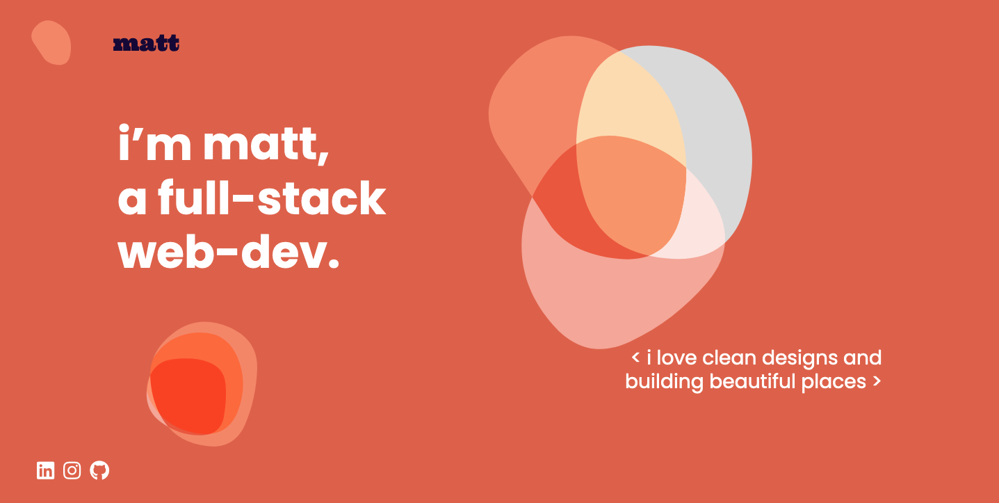
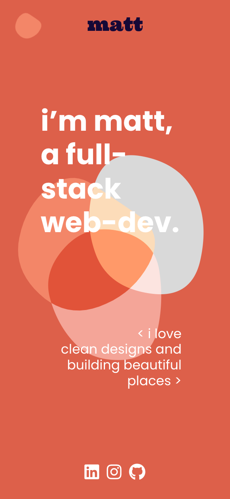

# T1A2 Portfolio - Matt Garrow

This is my portfolio website.

- [Netlify link](https://aquamarine-gelato-250f77.netlify.app/index.html)

- [Github repository](https://github.com/mjkgarrow/t1a2-portfolio-2)

- [Presentation video]()

Desktop view:

  

Mobile view:

  

---

## Purpose:

The main purpose of my website is to showcase who I am, what I like to work on, my resume and my skillset.

The secondary purpose is to demonstrate my front-end abilities, my aesthetic style, my personality and my thoughts on web development.

---

## Functionality & Features

#### Technology

- This website is mobile-first and has 2 media breakpoints at 600px (for tablets) and 1000px (desktop).

- I utilised flex-box for my styling.

- I used [Highlight.js](https://highlightjs.org/) for some of the code snippets I used in the blog section. The theme is [atom-one-dark](https://cdn.jsdelivr.net/npm/highlight.js@11.6.0/styles/atom-one-dark.css).

#### What I'm proud of:

- I created beautiful looking blog post cards and project cards that included images that scale when you hover over them, without expanding past the size of the containing div. This was a difficult process and took a few days to implement.

- The background shapes took a long time to make and get the animations working just right and responsive. I used inline svgs instead of a file so that I could adjust things like fill and blend-mode in css. I made the shapes using [Blob Maker](https://passionhacks.com/blob-maker/).

- I'm really proud of the layout of the site. The use of negative space, a clean font, and a visually striking style really set the portfolio apart from my earlier iterations.

#### The difficulties

- I had a hard time settling on the right way to do a navigation menu. My original thought was to use a hamburger menu, as can be seen in my wireframe. However I abandoned that idea because it didn't match my design language. I opted to use an animating blob that has some javascript to active at the navigation menu. The blob fits well with the feel of the site as well as being a bit playful and fun to use. The navigation itself is animated and creates a blurred background when it appears on.

- The colour scheme was a tough choice as well. There were so many options and they all looked really great. I changed up the colour scheme about 10 times before settling on a monochrome aesthetic. This seemed to match with the artistic UI/UX tone while also keeping the styling simple and easy to replicate across the site.

---

## Target Audience

This website is for mostly targeted to a front-end employer. It doesn't have much (or any) back-end features and is entirely HTML and CSS.

I made the colourway, images and functionality appeal visually and the styling is about displaying information clearly.

---

## Tech stack

Deployed with [Netlify](https://www.netlify.com)

---

I deviated from my wireframes quite a lot, but they were very helpful in laying out the design.

Colour choices are in line with accessability guidelines for appropriate contrast levels and viewing.

Wireframe: [Figma link](https://www.figma.com/file/efpb32yzwvxEcuG2w1a3IM/Portfolio)

