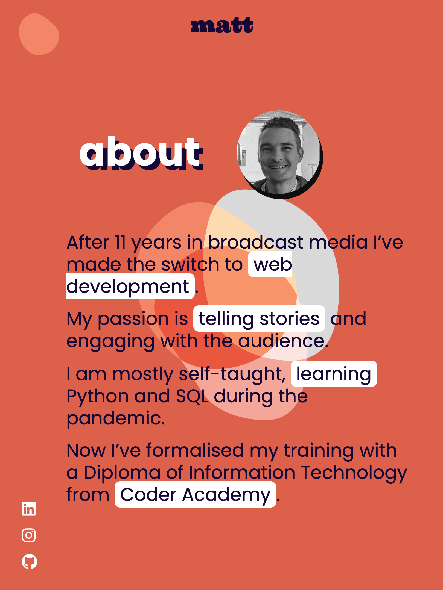

# T1A2 Portfolio - Matt Garrow

Welcome to my portfolio website.

- [Netlify link](https://mattgarrow.netlify.app/)

- [Github repository](https://github.com/mjkgarrow/t1a2-portfolio-2)

- [Presentation video]()

- [Wireframe](https://www.figma.com/file/y82inPoxJzu0kpWrcMoRf3/T1A2-Portfolio)

---

## Screenshots

Mobile:

  
  
  
  
  
  
  
  

Tablet:

  
  
  
  
  
  
  
  

Desktop:

  
  
  
  
  
  
  
  

---

## Sitemap

  

 
---

## Figma wireframes

  

  

## Purpose:

This portfolio site is to showcase to employers the following skills:

- UI/UX design

- Writing clean, syntactically and semantically valid HTML and CSS

- Artistic flair

The primary purpose of my website is to showcase who I am, what I like to work on, my resume and my skillset as a web developer.

The secondary purpose is to demonstrate my front-end abilities, my aesthetic style, my personality and my availability for work.

This portfolio is designed to be memorable and iconic for future employers.

---

## Functionality & Features

#### Technology

- This website is mobile-first and has 2 media breakpoints at 600px (for tablets) and 1000px (desktop).

- I utilised flex-box for the majority of my styling.

- I used [Highlight.js](https://highlightjs.org/) for some of the code snippets I used in the blog section. The theme is [atom-one-dark](https://cdn.jsdelivr.net/npm/highlight.js@11.6.0/styles/atom-one-dark.css).

- I used [Font Awesome](https://fontawesome.com/) to source the icons from the footer.

- I used [DevIcons](https://devicon.dev/) for the tech stack icons.

- I drew animation inspiration from [w3resource](https://www.w3resource.com/html-css-exercise/html-css-practical-exercises/html-css-practical-exercise-15.php) for the underline animations on the home page.

- SVGs created with [Blob Maker](https://passionhacks.com/blob-maker/).

#### Features

- Animated background SVGs used throughout the site. They are small file size and scale well on all devices.

- Unique navigation button that uses an animated SVG.

- Clean footer with quick access links to my most used social media/repositories.

- Responsive headers and main section content. Have tested on a real phone to make sure it is working correctly.

- Glassmorphism aesthetic UI design that helps feature the animating background.

- Validated HTML syntax.

- Use of small-size, efficient webp image formats on all images.

- Most pages passed Google Chrome Lighthouse reports with 93% or more (pages with lots of images scored lower).

- Custom favicon, created with the same Google Font the header logo uses. Favicons generated with [favicon.io](https://favicon.io/favicon-generator/).

---

## Target Audience

This website is for targeted to a front-end employer. It doesn't have much (or any) back-end features and is entirely HTML and CSS.

I made the colourway, images and functionality appeal visually and the styling is about displaying information clearly.

---

## Tech stack

- HTML
- SCSS/SCC
- Markdown
- Javascript
- [Netlify](https://www.netlify.com)
- [Figma](https://www.figma.com)

---

This is my second portfolio. I built the first one ([here](https://neon-flan-079ccf.netlify.app/)) and learned so much I made a new one. This second site showcases much more of my skills and style.

---

## Resources

- Images: [PXHere](https://pxhere.com)
- Icons: [DevIcons](https://devicon.dev/)
- Underline animation: [w3resource](https://www.w3resource.com/html-css-exercise/html-css-practical-exercises/html-css-practical-exercise-15.php)

---

## Inspiration

Some of the websites that inspired me and helped focus my design.

  
  
  
  
  

